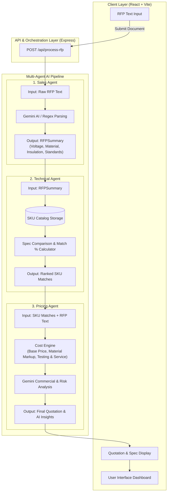

# RFP Agent AI

## Overview

RFP Agent AI is a B2B enterprise application for automated Request for Proposal (RFP) processing and quote generation, specifically designed for the wires and cables manufacturing industry. The system uses a multi-agent architecture to extract requirements from RFP documents, match specifications to a product catalog, and generate pricing estimates.

The application follows a three-agent workflow:
1. **Sales Agent** - Extracts and summarizes RFP requirements (voltage, material, insulation, compliance)
2. **Technical Agent** - Matches RFP specifications to the SKU catalog with match percentages
3. **Pricing Agent** - Generates detailed cost estimates including material, service, and testing costs

## Workflow Diagram

### Architecture & Agent Pipeline



### Agent Execution Sequence

```mermaid
sequenceDiagram
    autonumber
    actor User as User / Client UI
    participant API as Express Server (/api/process-rfp)
    participant Sales as Sales Agent
    participant Gemini as Gemini AI Service
    participant Tech as Technical Agent
    participant DB as Product Catalog DB
    participant Pricing as Pricing Agent

    User->>API: POST /api/process-rfp (RFP Text)
    
    rect rgb(20, 83, 45)
        note over Sales,Gemini: Step 1: Requirements Extraction
        API->>Sales: runSalesAgent(rfpText)
        Sales->>Gemini: Extract Technical Specs
        Gemini-->>Sales: Extracted Specs (JSON)
        Sales-->>API: RFPSummary (Voltage, Material, Insulation, etc.)
    end

    rect rgb(30, 58, 138)
        note over Tech,DB: Step 2: Technical SKU Matching
        API->>Tech: runTechnicalAgent(summary)
        Tech->>DB: getSkuCatalog()
        DB-->>Tech: Product Catalog SKUs
        Tech->>Tech: Match Specifications & Calculate Match %
        Tech-->>API: Ranked SKU Matches
    end

    rect rgb(112, 26, 117)
        note over Pricing,Gemini: Step 3: Cost Estimation & Risk Analysis
        API->>Pricing: runPricingAgent(matches, rfpText)
        Pricing->>Pricing: Calculate Base, Material, Service & Testing Costs
        Pricing->>Gemini: Generate Commercial Risk Analysis
        Gemini-->>Pricing: Commercial & Risk Recommendations
        Pricing-->>API: Final Quotation & Grand Total
    end

    API-->>User: Consolidated RFP Response (Summary, Matches, Pricing, Analysis)
```



## User Preferences

Preferred communication style: Simple, everyday language.

## System Architecture

### Frontend Architecture
- **Framework**: React with TypeScript
- **Build Tool**: Vite with hot module replacement
- **Routing**: Wouter (lightweight React router)
- **State Management**: TanStack React Query for server state
- **UI Components**: shadcn/ui component library built on Radix UI primitives
- **Styling**: Tailwind CSS with CSS variables for theming
- **Design System**: Carbon Design System (IBM) approach - optimized for enterprise data-heavy applications
- **Typography**: IBM Plex Sans and IBM Plex Mono fonts

### Backend Architecture
- **Runtime**: Node.js with Express
- **Language**: TypeScript with ESM modules
- **API Pattern**: RESTful endpoints under `/api/` prefix
- **Agent System**: Three specialized agents (Sales, Technical, Pricing) implemented as pure TypeScript functions
- **Data Storage**: In-memory storage with SKU catalog defined in shared schema

### Project Structure
```
├── client/           # React frontend application
│   └── src/
│       ├── components/   # UI components and examples
│       ├── pages/        # Route pages (home, not-found)
│       ├── hooks/        # Custom React hooks
│       └── lib/          # Utilities and query client
├── server/           # Express backend
│   ├── agents/       # Sales, Technical, and Pricing agents
│   ├── routes.ts     # API route definitions
│   └── storage.ts    # Data storage interface
├── shared/           # Shared types and schemas (Zod validation)
└── migrations/       # Database migrations (Drizzle)
```

### Data Flow
1. User inputs RFP text via the frontend
2. Frontend calls `/api/process-rfp` endpoint
3. Backend orchestrates the three agents sequentially
4. Results (summary, SKU matches, pricing) returned to frontend
5. Frontend displays results in cards, tables, and status indicators

### Validation
- Zod schemas for request/response validation
- Shared schema definitions between frontend and backend
- Type-safe API contracts

## External Dependencies

### Database
- **ORM**: Drizzle ORM configured for PostgreSQL
- **Schema Location**: `shared/schema.ts`
- **Migrations**: Stored in `migrations/` directory
- **Note**: Currently uses in-memory storage for SKU catalog; database integration available via Drizzle

### UI Libraries
- **Radix UI**: Full suite of accessible primitive components
- **shadcn/ui**: Pre-styled component library
- **Lucide React**: Icon library
- **Embla Carousel**: Carousel functionality
- **cmdk**: Command palette component

### Build & Development
- **Vite**: Frontend bundling with React plugin
- **esbuild**: Server bundling for production
- **tsx**: TypeScript execution for development

### Form & Validation
- **React Hook Form**: Form state management
- **Zod**: Schema validation
- **drizzle-zod**: Zod integration with Drizzle schemas

## Connect with Me
- If you found this project helpful or have any suggestions, feel free to connect:

- [](https://www.linkedin.com/in/anshmnsoni)  
- [](https://github.com/AnshMNSoni)
- [](https://www.reddit.com/user/AnshMNSoni)

## License
This project is licensed under the [MIT License](LICENSE).

# Thankyou
