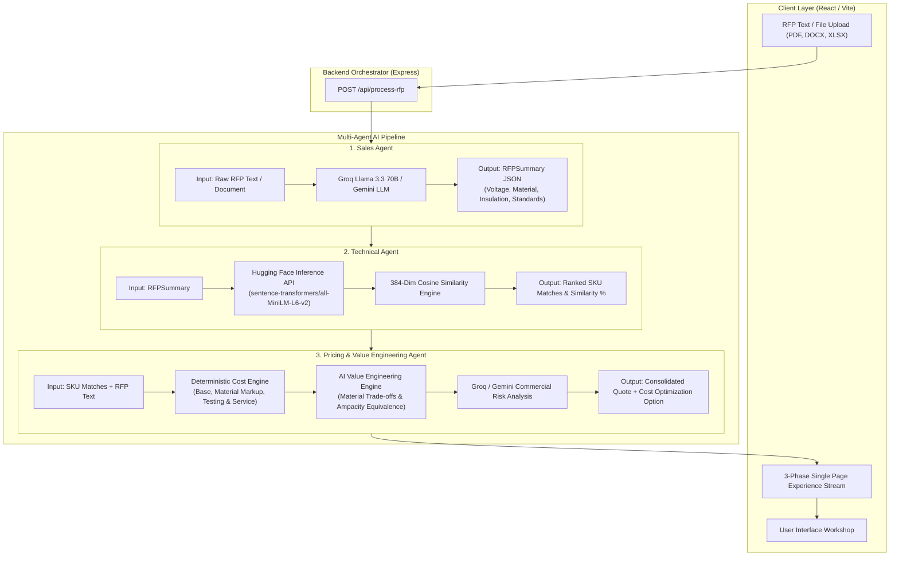

# RFP Agent


## Overview

RFP Agent AI is an AI-powered B2B enterprise application for automated Request for Proposal (RFP) processing and quote generation, specifically designed for the wires and cables manufacturing industry. The system uses a multi-agent architecture powered by **Google Gemini AI** to intelligently extract requirements from RFP documents, match specifications to a product catalog, and generate pricing estimates.

The application follows a three-agent workflow with AI-enhanced intelligence:
1. **Sales Agent** - Uses natural language understanding to extract and summarize RFP requirements (voltage, material, insulation, compliance standards)
2. **Technical Agent** - Intelligently matches RFP specifications to the SKU catalog with match percentages and provides reasoning for each match
3. **Pricing Agent** - Generates detailed cost estimates with smart quantity recommendations, including material, service, and testing costs, plus strategic pricing analysis

## Key Features

- **AI-Powered Processing** - Leverages Google Gemini Pro for intelligent document understanding
- **Smart SKU Matching** - AI evaluates technical compatibility beyond simple keyword matching
- **Intelligent Pricing** - Context-aware quantity recommendations and pricing strategies
- **Fallback Logic** - Graceful degradation to rule-based processing if AI is unavailable
- **Fast Processing** - Typical RFP processing in 10-15 seconds
- **High Accuracy** - AI reasoning provides transparency in matching and pricing decisions

## AI & ML Integration

The system follows a hybrid multi-agent architecture combining **Generative AI (LLMs)** for text understanding, **Predictive ML (Vector Embeddings)** for semantic matching, and **Deterministic Code** for financial math.

### Models & Infrastructure

- **Primary LLM Provider**: **Groq Cloud API** (`llama-3.3-70b-versatile`)
  - **SDK**: `groq-sdk`
  - **Role**: Ultra-fast sub-second Sales Agent RFP extraction & Pricing Agent commercial risk analysis
  - **Key Link**: [Groq Console](https://console.groq.com/keys)

- **Fallback LLM Provider**: **Google Gemini Pro** (`gemini-pro`)
  - **Role**: Automatic fallback if Groq API is unconfigured

- **ML Embedding Provider**: **Hugging Face Inference API**
  - **Model**: [`sentence-transformers/all-MiniLM-L6-v2`](https://huggingface.co/sentence-transformers/all-MiniLM-L6-v2)
  - **Role**: Technical Agent 384-dimensional vector embedding generation & Cosine Similarity SKU catalog matching
  - **Key Link**: [Hugging Face Model Page](https://huggingface.co/sentence-transformers/all-MiniLM-L6-v2)


- **Infrastructure Overhead**: Zero server memory impact on Render (100% cloud inference via Serverless APIs)

### Multi-Agent Pipeline Breakdown

#### 1. Sales Agent (LLM Extractor)
- Extracts structured specification JSON from unstructured RFP text
- Identifies voltage ratings, conductor materials, insulation types, and compliance standards (`IS 7098`, `IEC 60502`)
- Automatic fallback to regex-based parsing if API is unconfigured

#### 2. Technical Agent (Hugging Face ML Vector Matcher)
- Calls Hugging Face Inference API for [`sentence-transformers/all-MiniLM-L6-v2`](https://huggingface.co/sentence-transformers/all-MiniLM-L6-v2)
- Generates 384-dimensional dense vectors for extracted RFP requirements and catalog items
- Computes mathematical **Cosine Similarity** to evaluate true semantic compatibility
- Ranked match scores (0-100%) with automated fallbacks to Gemini AI / rule-based matching

#### 3. Pricing Agent (Deterministic Financial Engine + LLM Risk & Value Engineering)
- Pure TypeScript code calculates base price, material markup (+20% copper factor), service charges (5%), and testing fees
- Eliminates financial math hallucinations by executing deterministic math formulas
- **AI Value Engineering Engine**: Evaluates material & thermal trade-offs (e.g. Copper → Ampacity-Equivalent Aluminium) to generate alternative cost-optimized quote option with technical compliance justification (`IEC 60502-2` / `IS 7098`)
- Gemini / Groq AI generates strategic commercial risk alerts and raw material price volatility recommendations

---

## Environment Configuration & Guidelines

### Environment Variables (`.env` / `.env.example`)

Copy [.env.example](file:///e:/Ansh-Stuffings/Work/Github/B2B-RFP-Project/.env.example) to `.env` in the root directory:

```bash
cp .env.example .env
```

Set the required API tokens inside `.env`:

```env
# Groq API Key (Ultra-Fast LLM Provider)
GROQ_API_KEY=your_groq_api_key_here

# Google Gemini API Key (Fallback LLM Provider)
GEMINI_API_KEY=your_gemini_api_key_here

# Hugging Face Access Token (Serverless Embedding API)
HF_TOKEN=your_huggingface_access_token_here

# Server Port (Default: 5000)
PORT=5000
```

### Verification Endpoints

Test system connections directly after launching the server:

- **Test Groq API**: `GET /api/test-groq`
- **Test Hugging Face Model**: `GET /api/test-huggingface`
- **Test Gemini API**: `GET /api/test-gemini`
- **System Health**: `GET /api/health`

---

## Workflow Diagrams

### Backend Multi-Agent Architecture



### Agent Execution Sequence

```mermaid
sequenceDiagram
    autonumber
    actor User as User / Client UI
    participant API as Express Server (/api/process-rfp)
    participant Sales as Sales Agent
    participant Gemini as Google Gemini Pro API
    participant Tech as Technical Agent
    participant HF as Hugging Face Inference API
    participant DB as Product Catalog DB
    participant Pricing as Pricing Agent

    User->>API: POST /api/process-rfp (RFP Text)
    
    rect rgb(20, 83, 45)
        note over Sales,Gemini: Step 1: Requirements Extraction (LLM)
        API->>Sales: runSalesAgent(rfpText)
        Sales->>Gemini: Extract Technical Specs (gemini-pro)
        Gemini-->>Sales: Extracted Specs (RFPSummary JSON)
        Sales-->>API: RFPSummary (Voltage, Material, Insulation, Standards)
    end

    rect rgb(30, 58, 138)
        note over Tech,HF: Step 2: Technical Vector SKU Matching (Hugging Face ML)
        API->>Tech: runTechnicalAgent(summary)
        Tech->>HF: Generate 384-dim Vector Embedding (all-MiniLM-L6-v2)
        HF-->>Tech: RFP Query Vector
        Tech->>DB: Fetch SKU Catalog Vectors
        Tech->>Tech: Compute Cosine Similarity & Spec Scores
        Tech-->>API: Ranked SKU Matches & Similarity Scores
    end

    rect rgb(112, 26, 117)
        note over Pricing,Gemini: Step 3: Cost Calculation & Commercial Risk Analysis
        API->>Pricing: runPricingAgent(matches, rfpText)
        Pricing->>Pricing: Execute Deterministic Financial Math (Base, Material, Service, Testing)
        Pricing->>Gemini: Generate Strategic Risk Analysis (gemini-pro)
        Gemini-->>Pricing: Commercial Risk Recommendations
        Pricing-->>API: Consolidated Quotation & Grand Total
    end

    API-->>User: Step-by-Step Progressive Reveal (Summary -> Matches -> Quotation)
```




## User Preferences

Preferred communication style: Simple, everyday language.

## System Architecture

### Frontend Architecture
- **Framework**: React with TypeScript
- **Build Tool**: Vite with hot module replacement
- **Routing**: Wouter (lightweight React router)
- **State Management**: TanStack React Query for server state
- **UI Components**: shadcn/ui component library built on Radix UI primitives
- **Styling**: Tailwind CSS with CSS variables for theming
- **Design System**: Carbon Design System (IBM) approach - optimized for enterprise data-heavy applications
- **Typography**: IBM Plex Sans and IBM Plex Mono fonts

### Backend Architecture
- **Runtime**: Node.js with Express
- **Language**: TypeScript with ESM modules
- **API Pattern**: RESTful endpoints under `/api/` prefix
- **Agent System**: Three AI-powered specialized agents (Sales, Technical, Pricing) with fallback logic
- **LLM Integration**: Google Gemini Pro API via fetch
- **Data Storage**: In-memory storage with SKU catalog defined in shared schema

### Project Structure
```
├── client/           # React frontend application
│   └── src/
│       ├── components/   # UI components and examples
│       ├── pages/        # Route pages (home, not-found)
│       ├── hooks/        # Custom React hooks
│       └── lib/          # Utilities and query client
├── server/           # Express backend
│   ├── agents/       # AI-powered Sales, Technical, and Pricing agents
│   │   ├── salesAgent.ts      # Gemini-powered RFP extraction
│   │   ├── technicalAgent.ts  # Gemini-powered SKU matching
│   │   └── pricingAgent.ts    # Gemini-powered pricing analysis
│   ├── routes.ts     # API route definitions
│   └── storage.ts    # Data storage interface
├── shared/           # Shared types and schemas (Zod validation)
└── migrations/       # Database migrations (Drizzle)
```

### Data Flow
1. User inputs RFP text via the frontend
2. Frontend calls `/api/process-rfp` endpoint
3. Backend orchestrates the three AI agents sequentially:
   - Sales Agent → Gemini API → RFP Summary
   - Technical Agent → Gemini API → SKU Matches with reasoning
   - Pricing Agent → Gemini API → Cost estimates with analysis
4. Results (summary, SKU matches, pricing, AI reasoning) returned to frontend
5. Frontend displays results in cards, tables, and status indicators

### Validation
- Zod schemas for request/response validation
- Shared schema definitions between frontend and backend
- Type-safe API contracts
- AI response validation with fallback handling

## External Dependencies

### AI & LLM
- **Google Gemini Pro**: Natural language understanding and intelligent processing
- **Generative AI API**: v1beta endpoint for content generation
- **Rate Limits**: 60 requests/min, 1,500 requests/day (free tier)

### Database
- **ORM**: Drizzle ORM configured for PostgreSQL
- **Schema Location**: `shared/schema.ts`
- **Migrations**: Stored in `migrations/` directory
- **Note**: Currently uses in-memory storage for SKU catalog; database integration available via Drizzle

### UI Libraries
- **Radix UI**: Full suite of accessible primitive components
- **shadcn/ui**: Pre-styled component library
- **Lucide React**: Icon library
- **Embla Carousel**: Carousel functionality
- **cmdk**: Command palette component

### Build & Development
- **Vite**: Frontend bundling with React plugin
- **esbuild**: Server bundling for production
- **tsx**: TypeScript execution for development

### Form & Validation
- **React Hook Form**: Form state management
- **Zod**: Schema validation
- **drizzle-zod**: Zod integration with Drizzle schemas

## Setup Instructions

### 1. Install Dependencies
```bash
npm install
```

### 2. Configure Environment Variables
Create a `.env` file in the project root:
```bash
GEMINI_API_KEY=your_gemini_api_key_here
```

### 3. Get Gemini API Key
1. Visit [Google AI Studio](https://makersuite.google.com/app/apikey)
2. Click "Create API Key"
3. Copy and paste into your `.env` file

### 4. Run Development Server
```bash
npm run dev
```

### 5. Build for Production
```bash
npm run build
npm start
```

## Deployment

### Render Configuration
1. Set environment variable `GEMINI_API_KEY` in Render dashboard
2. Configure timeout settings:
   - Health Check Timeout: 300 seconds
   - Health Check Interval: 60 seconds
3. Deploy and verify via logs

### Other Platforms
- **Vercel**: Add `GEMINI_API_KEY` to environment variables
- **Railway**: Configure environment variables in project settings
- **AWS/GCP**: Set environment variables in deployment configuration

## API Endpoints

### Process RFP
```
POST /api/process-rfp
Content-Type: application/json

{
  "rfpText": "RFP Title: Supply of Industrial Power Cables..."
}

Response:
{
  "success": true,
  "summary": {
    "title": "Supply of Industrial Power Cables",
    "voltage": "11kV",
    "material": "Copper",
    "insulation": "XLPE",
    ...
  },
  "matches": [
    {
      "sku": "CAB-11KV-CU-XLPE",
      "matchPercentage": 100,
      "reasoning": "Perfect match for voltage, material, and insulation requirements",
      ...
    }
  ],
  "pricing": {
    "items": [...],
    "grandTotal": 213220,
    "analysis": "Recommended quantity optimized for 11kV industrial project scope..."
  }
}
```

### Test Gemini Connection
```
GET /api/test-gemini

Response:
{
  "success": true,
  "apiKeyExists": true,
  "response": {...}
}
```

### Health Check
```
GET /api/health

Response:
{
  "status": "healthy"
}
```

## Performance

- **Average Processing Time**: 10-15 seconds per RFP
- **Agent Breakdown**:
  - Sales Agent: ~3-5 seconds
  - Technical Agent: ~3-5 seconds
  - Pricing Agent: ~3-5 seconds
- **Free Tier Capacity**: ~500 RFPs per day
- **Fallback Performance**: <1 second (rule-based processing)

## Future Enhancements

- [ ] Multi-document processing (PDFs, Word docs)
- [ ] Real-time collaboration features
- [ ] Advanced analytics dashboard
- [ ] Custom SKU catalog management
- [ ] Email integration for automatic RFP ingestion
- [ ] Multi-language support
- [ ] Historical RFP analysis and insights
- [ ] Integration with ERP systems

## Troubleshooting

### Common Issues

**502 Gateway Error**
- Check timeout configuration on hosting platform
- Verify `GEMINI_API_KEY` is set correctly
- Check Render/platform logs for specific errors

**"No response from Gemini API"**
- Verify API key is valid at [Google AI Studio](https://makersuite.google.com/)
- Check if free tier quota is exceeded
- System will fall back to rule-based processing

**Agents returning fallback results**
- Check deployment logs for Gemini API errors
- Verify internet connectivity from server
- Confirm API key has proper permissions

## Connect with Me

If you found this project helpful or have any suggestions, feel free to connect:

- [](https://www.linkedin.com/in/anshmnsoni)  
- [](https://github.com/AnshMNSoni)

## License

This project is licensed under the [MIT License](LICENSE).

## Acknowledgments

- **Google Gemini Pro** for AI-powered intelligent processing
- **shadcn/ui** for beautiful, accessible UI components
- **Radix UI** for primitives and accessibility
- **IBM Carbon Design System** for enterprise design patterns

---

## Thank You
